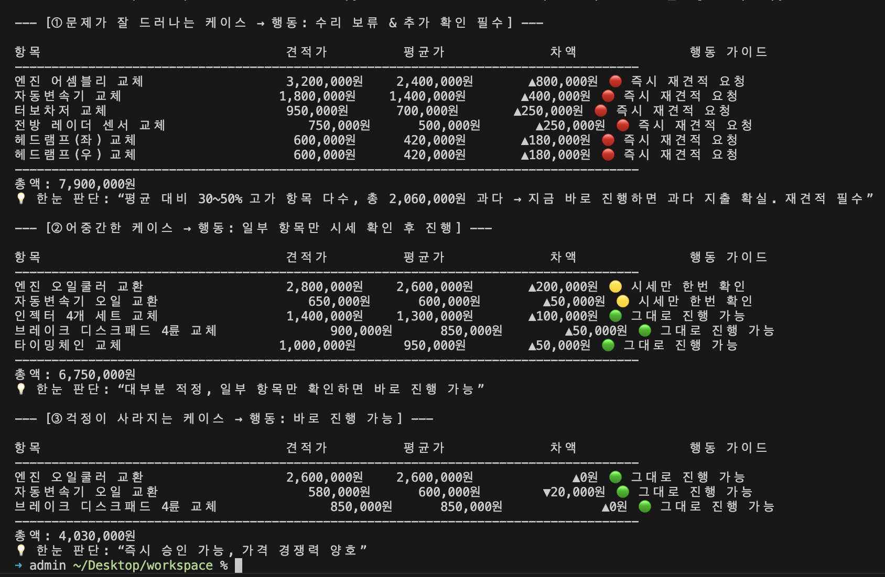
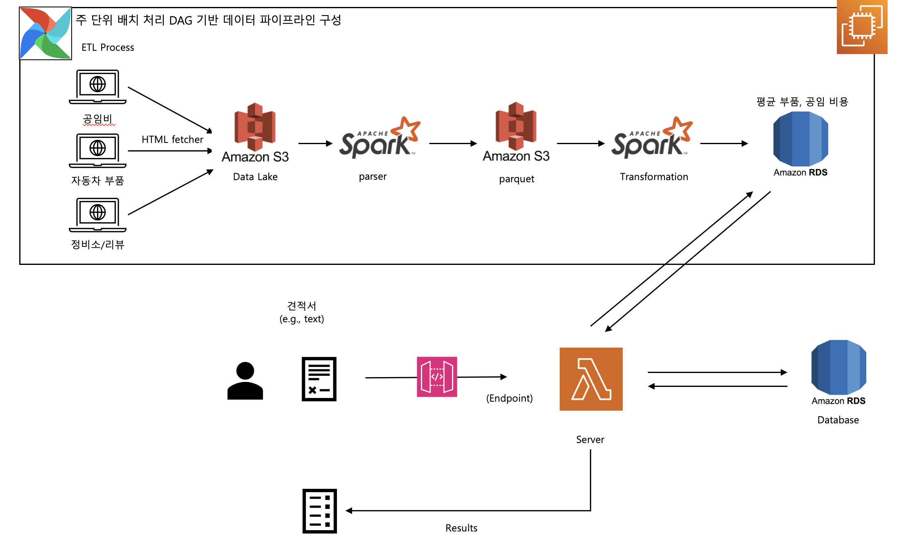

# 🚗 Softeer Bootcamp 6기 DE 2팀 : 현대 업고 튀어

## 👥 팀원
- 박건희
- 신주환
- 창경현

## 기
---

## ⏱ Ground Rules

### TimeBoxing (사이클 당 1시간)
- **Process 1**
  1. 아이디어 구상 및 정보 조사 (40분)
  2. 아이디어 공유 & 문제 정의 검증 (15분)
  3. 구체화 필요 여부 결정 (5분)
- **Process 2**
  1. 구체화된 아이디어 세부 설계 (40분)
  2. Pros & Cons 작성 및 비교 (15분)
  3. 개선점 도출 (5분)

**판단 기준**
1. 경제적 가치 = 고통의 크기 (Must-have 중심)
2. 데이터 존재 여부

---

## 📎 작업 링크
- **Notion Workspace** : [DE 2팀 노션 바로가기](https://www.notion.so/DE-245ef8f2406c8042b85de205474f5e75)

---

## 📌 프로젝트 소개
**정비 견적 검증 및 합리적 정비 가이드**  
차량 수리 견적이 500만 원 이상 청구된 차량 소유주를 대상으로,  
정비사가 책정한 **부품 가격**과 **공임비**의 적정성을 검증하는 데이터 기반 가이드 시스템을 개발합니다.

### 🎯 문제 정의
- **누구의 문제인가?**  

  - 차량 수리 견적이 500만 원 이상 청구된 차량 소유주
  
- **어떤 문제인가?**  

  - 견적서에 적힌 부품·공정 가격이 적절한지 판단하기 어려움
  
  - 가격 검증에 필요한 정보 부족으로 의사 결정 지연 또는 잘못된 선택 발생
  
- **배경 상황**  

  - 정비사가 부품명과 공임비가 빼곡히 적힌 견적서를 보여주며 "총 1000만원입니다" 라고 통보하는 순간. 가격은 적정한지 알 길이 없어 수리를 결정하거나 거부하기 어려움

	- 차량의 상태, 필요한 정비, 부품 가격, 적정 공임에 대한 모든 정보는 정비사가 독점하고 있습니다. 운전자는 이 정보에서 철저히 소외되어 있어, 일방적으로 끌려갈 수밖에 없는 구조적인 '을'의 위치에 있다.

---

## 🛠 해결 방안
1. **부품 가격 검증**

   - 견적서에서 부품명을 인식
   
   - 온라인 부품몰에서 실시간 크롤링을 통해 평균 시세 수집
   
   - 견적서 가격과 비교하여 적정성 판단

2. **공임비 검증**

   - 견적서에서 정비 항목을 인식
   
   - 표준 정비 시간과 플랫폼 보유 **지역/차종별 평균 공임 데이터** 비교
   
   - 과다/적정 여부 판단

---

## 📊 예상 가치 및 기대 효과

- 가치

	- 2024년도 발생한 중사고로 분류된 사고가 약 48,000건이 발생했다. 
	
	- 이는 중상자 이상의 인명피해를 일으킨 사고만을 집계한 경우인데, 이런 사고를 겪은 당사자의 약 5%만 이용해도 2400건의 이용 횟수가 집계될 가능성이 생긴다. 
	
	- 한 건당 5만원의 이용료를 걷는다면 이는 1년에 약 1억 원 이상의 수익을 올릴 수 있을 것으로 예상할 수 있다.

- 차량 수리비에 대한 **투명성** 확보

- 소비자의 **정보 비대칭 해소**

- 정비 업계의 **가격 합리화** 유도

---

## Pre-Totyping

---

## Architecture

---
